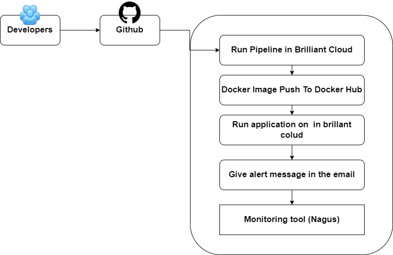
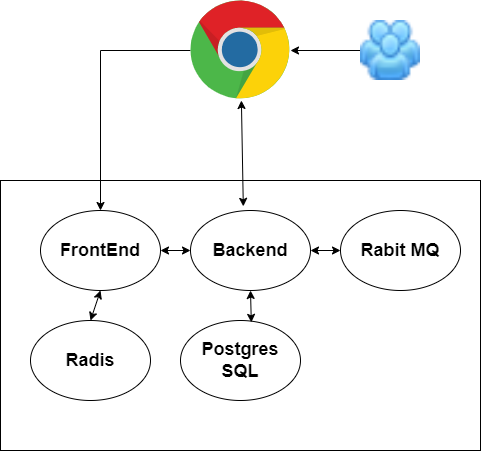

## Scenario

- Agile SDLC
- Developers make regular code changes.
- These commits needs to be Build & Tested.
- Usually Build & Release Team will do this job.
- Developers responsibility to merge and integrate code.

## Tools

- CircleCI (CI server)
- Git (Version Control System)
- Eslint (Code analysis tool)
- Email (Notification)
- Docker (Containerization)
- Brilliant Cloud (Compute Resource)

## Objective

Goals

- Auto deploy
- Short MTTR (Minium Time To Repair)
- Fast turn around on feature changes
- Less Disruptive
- High Scalability

## Architecture of CI Pipeline

### Workflow

### User Flow

## Flow of execution

1. Login to Brilliant Cloud
2. Create VPC
3. Create Subnet
4. Create Key pair
5. Create security group for frontend-sg, backend-sg, db-sg
6. Create 3 instances
7. Post installation
   - Docker, nagios, git
8. Build job with CircleCI
9. Email Notification

